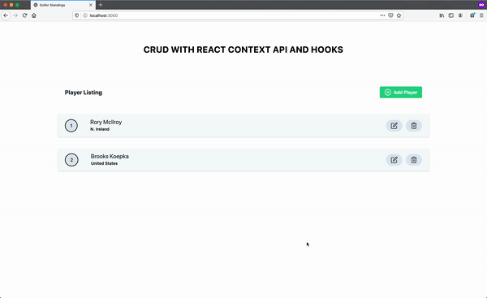

<!-- PROJECT SHIELDS -->

[![Issues][issues-shield]][issues-url]

<!-- PROJECT HEADER/LOGO -->
<br />
<p align="center">
  <a href="https://reactjs.org/">
    
  </a>

  <h3 align="center">REACT CRUD APP</h3>

  <h4 align="center">
    Built with the Context API & Hooks
    <br />
    <br />
    <a href="https://reactjs.org/"><strong>Go To The Demo Site »</strong></a>
    <br />
  </p>
</p>

## Table of Contents

- [About](#about-the-project)
  - [Built With](#built-with)
  - [Installation](#installation)
- [Context API](#context)
- [Hooks](#hooks)
- [Roadmap](#roadmap)
- [Contact](#contact)

## About

[](https://reactjs.org/)

The goal of this project is to get familiar and comfortable with the Context API and React Hooks. These features enable builting a clean, modern front-end web application.

### Built With

- Front-End Framework: [React](https://reactjs.org/)
- CSS Framework: [Tailwind](https://tailwindcss.com/)
- Hosting: [GitHub Pages](https://pages.github.com/)

### Installation

1. Clone the repo

```sh
git clone https://github.com/tim-corley/react-crud-app.git
```

2. Install packages

```sh
yarn install
```

3. Start browser-sync to launch site

```sh
yarn start
```

## React Context API

[Offical Docs](https://reactjs.org/docs/context.html)

Avoid "prop drilling"! Instead, share/pass data around the application without sending through each intermediate component between the parent and child.

## React Hooks

[Offical Docs](https://reactjs.org/docs/hooks-intro.html)

Use state within functional components!

## Roadmap / To-Do

See the [open issues](https://github.com/tim-corley/react-crud-app/issues) for a list of proposed features and/or improvements (as well as any known issues).

## Contact

Tim Corley | [@tcor215](https://twitter.com/tcor215) | contact@tim-corley.com

## License

Distributed under the MIT License.
